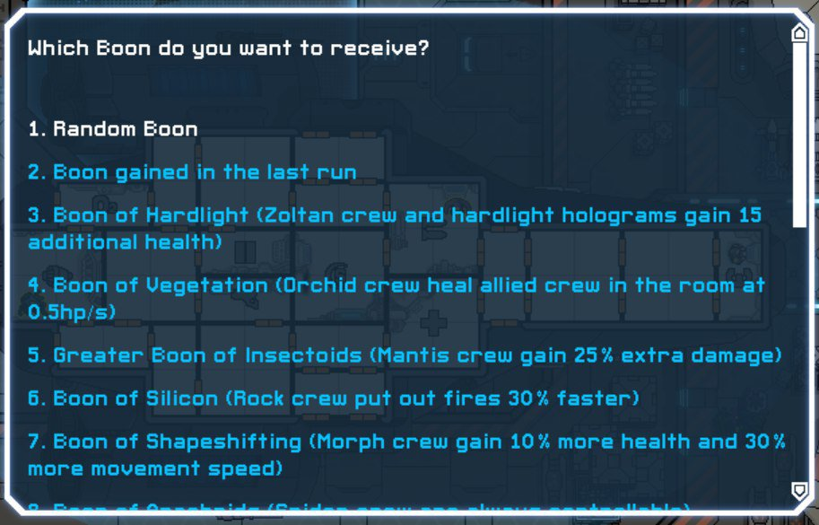

# FTL Multiverse Judge Boon Selector Mod

[Download](https://github.com/benediktwerner/FTL-Multiverse-Judge-Boon-Selector-Mod/releases/download/v1.0.1/Multiverse.Judge.Boon.Selector.ftl)

Allows selecting the boon you receive from the Judges at the start of a run instead of it being based on the previous run. You can only select boons that you have already unlocked by presenting the corresponding crew/system/weapon to the Judges.

This obviously can screw with the balance a bit since some boons are rather OP but I don't really find the current system very satisfying since many of the boons only make sense if you play a rather similar ship/setup to what you just played (e.g. presenting crew generally improves playing the same race again or presenting a max Drone Control improves playing with Drones again).

